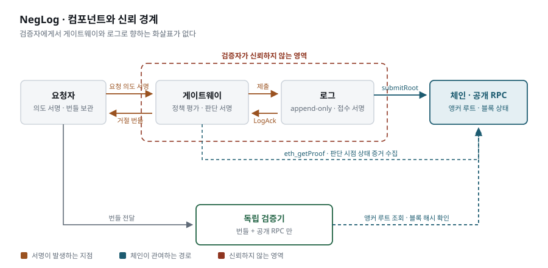
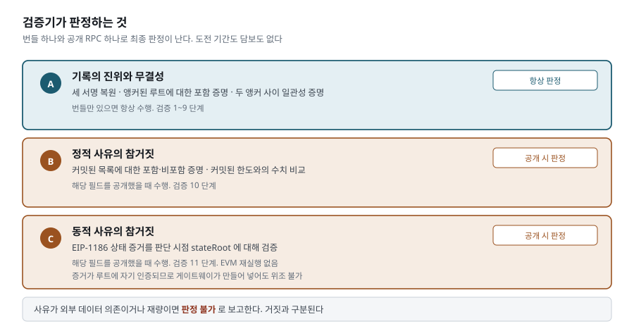

# OCDL

체인에 남지 않는 거절을 증명한다. Off-Chain Decision Log.

커스터디나 번들러가 트랜잭션을 **브로드캐스트하기 전에** 막으면 체인에는 아무것도 안
남는다. 남는 건 기관 DB의 텍스트 한 줄과 사용자 화면의 오류 메시지뿐이다. 그 상태에서
기관은 요청을 받은 적 없다고 할 수 있고, 사유와 시각을 나중에 고칠 수 있고, 불리한
기록을 지울 수 있다. 외부에서 반박할 방법이 없다.

OCDL 은 그 거절에 증거를 붙인다. 제3자는 기관 서버에 한 번도 접촉하지 않고 판단의
진위, 기록의 불변성, 거절 사유의 참거짓까지 확인한다.

TRUST404 트랙 3 — Off-chain Decision Provenance 제출작.

## 30초 안에 확인하기

```bash
npm install
npm run demo1
```

`demo1`은 번들러가 "EntryPoint 예치금 부족"을 사유로 UserOperation을 드랍하는 상황을
만든다. 거절 번들을 파일로 굳힌 뒤 **로그 서버 프로세스를 내리고** 검증 도구를 별도
프로세스로 띄운다.

```
  09  로그 서버 종료  이제 기관 쪽에서 가져올 수 있는 것이 없다
  10  로그 서버 확인  연결 거부 — fetch failed

  $ node cli/verify-rejection.ts rejection_bundle.json --rpc http://127.0.0.1:8957

  통과     1. 필드 집합과 커밋 루트
  통과     2. 게이트웨이 서명
  통과     3. 레지스트리 등록
  통과     4. 요청자 서명
  통과     5. 로그 접수 확인
  통과     6. 포함 증명
  통과     7. 일관성 증명
  통과     8. 선택적 공개
  통과     9. 정책 커밋
  통과     10. 정적 사유
  실패     11. 동적 사유
            거짓 동적 사유. 블록 3 슬롯 값 5000000000000000000 < 1000000000000000000 가 거짓

  판정: 11단계에서 실패
  책임: 정상
```

기관 서버는 죽어 있는데 검증이 끝난다. 그리고 번들러가 댄 사유가 거짓이라는 것까지
나온다. 판단 시점 예치금이 요청액보다 컸다.

anvil과 forge가 필요하다. `curl -L https://foundry.paradigm.xyz | bash`

## 나머지 두 데모

```bash
npm run demo2   # 로그 운영자가 DB를 직접 고치고 리프를 지운다
npm run demo3   # 게이트웨이가 목록 안에 있는 주소를 목록 밖이라고 거절한다
```

`demo2`는 운영자가 HTTP API를 안 거치고 SQLite에 직접 UPDATE를 날린다. 접수 검증도
서명 검증도 안 탄다. 그런데 남의 리프만 고쳤는데도 내 기록의 검증이 6단계에서 깨진다.
audit path가 이웃의 해시를 지나가기 때문이다. 조작한 루트를 같은 크기로 다시 앵커하려
하면 컨트랙트가 거부한다.

`demo3`은 1~9단계가 전부 통과한다. 서명도 포함 증명도 정책 인용도 정상이다. 거짓말은
10단계에서만 드러난다.

## 손으로 돌리기

데모 스크립트는 한 프로세스에서 전부 띄운다. 각 주체를 따로 세우려면 이렇게 한다.

```bash
anvil --port 8545

cd contracts && LOG_OPERATOR=$OP_ADDR forge script script/Deploy.s.sol \
  --rpc-url http://127.0.0.1:8545 --broadcast --private-key $OWNER_KEY

cast send $ANCHOR "setGateway(address,bool)" $GW_ADDR true \
  --rpc-url http://127.0.0.1:8545 --private-key $OWNER_KEY
```

로그 서버와 앵커 작업은 별도 프로세스다. 앵커는 차단 경로 밖에서 주기적으로 돈다.

```bash
node cli/log-server.ts --db ./log.db --port 8788 \
  --anchor $ANCHOR --rpc http://127.0.0.1:8545 --operator-key $OP_KEY

node cli/anchor.ts --db ./log.db --anchor $ANCHOR \
  --rpc http://127.0.0.1:8545 --operator-key $OP_KEY --watch 15
```

게이트웨이는 세 단계다. 목록을 판단보다 **먼저** 공표해야 검증 9단계가 통과한다.

```bash
node cli/gateway.ts publish-list --anchor $ANCHOR --rpc http://127.0.0.1:8545 \
  --log http://127.0.0.1:8788 --gateway-key $GW_KEY --out policy-update.json

node cli/gateway.ts reject --target 0x…cafe --value 5000000000000000000 \
  --anchor $ANCHOR --rpc http://127.0.0.1:8545 --log http://127.0.0.1:8788 \
  --gateway-key $GW_KEY --requester-key $RQ_KEY --out receipt.json

node cli/gateway.ts bundle --receipt receipt.json --out bundle.json --wait 90 \
  --anchor $ANCHOR --rpc http://127.0.0.1:8545 --log http://127.0.0.1:8788 \
  --gateway-key $GW_KEY
```

거절과 번들이 나뉘는 게 핵심이다. 거절 직후에는 그 리프를 덮는 앵커가 아직 없어서
포함 증명이 안 나온다. 요청자는 영수증을 먼저 받아두고 앵커가 올라간 뒤에 번들을
굳힌다. `--wait`가 그때까지 기다리고, 실제 걸린 시간을 로그가 서명한 상한과 나란히
찍는다.

```
편입까지 12초  (로그가 서명한 상한 3600초)
```

이제 로그 서버를 내려도 된다.

```bash
node cli/verify-rejection.ts bundle.json --rpc http://127.0.0.1:8545
```

종료 코드는 통과 0, 실패 1, 번들이나 RPC 자체가 깨졌으면 2다. 판정 불가 단계가
있어도 다른 단계가 다 통과하면 0이고, 보고서가 어느 단계를 못 따졌는지 적는다.
`--json`을 주면 보고서를 기계가 읽는다.

부하를 보려면 `node cli/seed.ts --count 20000 …`으로 먼저 채운다. 2만 건이면 DB는
42MB지만 번들은 8.8KB다. 포함 증명 경로가 로그 스케일로만 자라기 때문이다.
초당 180건쯤 들어가고 병목은 서명이다.

## 어떻게 되어 있나



게이트웨이가 요청을 막으면 판단에 EIP-712로 서명한 레코드를 만든다. 요청자에게 먼저
주고 로그에 제출한다. 로그는 RFC 6962 머클 트리에 넣고 접수 확인에 서명한다. 앵커
작업이 주기적으로 루트를 체인에 올린다.

체인은 차단 경로에 없다. 루트만 나중에 비동기로 올라간다. 체인이 멈춰도 판단은 돈다.

검증할 때 결정적인 건 **재계산한 루트를 무엇과 비교하느냐**다. 로그 서버가 알려준
루트와 비교하면 아무것도 증명하지 못한다. 거짓 루트를 불러주면 그만이다. 그래서
[`lib/verify.ts`](lib/verify.ts)의 6단계는 로그가 준 값을 버리고 체인의
`rootByTreeSize`를 직접 읽는다.

## 무엇을 해시하고 서명하는가

원문은 로그에 올라가지 않는다. 필드마다 다른 난수를 붙여 해시한 값만 올린다.

```
h_i        = SHA256("ocdl/field/v1|" + JCS([salt_i, key, value]))
keysRoot   = SHA256(JCS(keys))
fieldsRoot = SHA256(h_0 ‖ … ‖ h_6)
leaf_hash  = SHA256(0x00 ‖ JCS(leaf))
```

난수가 필드마다 달라야 한다. `severity`는 값이 `block`·`hold`·`review` 셋뿐이라
난수 없이 해시하면 세 번 계산해서 맞춰보면 끝난다.

서명 대상은 EIP-712 `RejectionRecord` 13필드다. 어떤 규칙집합 하에서, 어떤 목록을 보고,
어떤 필드를 어떤 값으로, 누구의 요청에 대해, 언제의 체인 상태로 판단했는지가 한 묶음에
들어간다. 하나라도 바꾸면 서명 복원이 실패한다.

필수 키 일곱 개. 사전순이며 이 순서가 곧 `field_hashes` 순서다.

| key | 봉인 |
|---|---|
| `calldata_hash` | 아니오 |
| `requester` | 예 |
| `rule_id` | 예 |
| `severity` | 아니오 |
| `target` | 예 |
| `value` | 예 |
| `verifiability` | 아니오 |

봉인한 필드는 커밋만 공개하고 원문은 요청자 번들에만 둔다. 무엇을 열지는 요청자가
정한다. 7개 중 4개만 열어도 검증 11단계가 전부 돈다.

`verifiability`를 봉인하지 않는 게 설계의 요점이다. 기관별 재량 사유 비율이 공개
통계가 되어야 한다.

스키마는 [`lib/record.ts`](lib/record.ts), 서명은 [`lib/sign.ts`](lib/sign.ts)에 있다.

## 검증 11단계

| 단계 | 확인 |
|---|---|
| 1 | 필드 집합, 두 루트 재계산, `leaf_hash` 가 리프 본문과 결속 |
| 2 | 게이트웨이 서명 복원 |
| 3 | 게이트웨이가 온체인 레지스트리에 등록됨 |
| 4 | 요청자 서명 복원, 해시가 리프 커밋과 일치 |
| 5 | 로그 접수 확인 서명, 발급 ≤ 접수 |
| 6 | 포함 증명이 **체인에서 읽은** 루트와 일치, 발급 ≤ 앵커 |
| 7 | **요청한 구간**의 일관성 증명, 두 구간 모두 앵커됨 |
| 8 | 공개된 값이 그 자리의 커밋과 일치 |
| 9 | 정책 해시, `rule_id` 실재, 목록이 판단보다 **먼저 공표**됨 |
| 10 | 정적 사유가 커밋된 목록과 모순되는가 |
| 11 | 동적 사유가 상태 증거와 모순되는가 |

결과는 세 값이다. 통과, 실패, **판정 불가**. 재량 사유를 실패로 처리하면 정직한 기관이
걸리고, 통과로 처리하면 아무 말이나 대는 기관이 빠져나간다.

10·11 중 하나도 판정되지 않으면 보고서가 "검증 통과" 라고 쓰지 않는다. "조작 흔적 없음,
다만 사유는 검증되지 않았다" 로 쓴다. 사유를 하나도 못 따진 것과 따져서 참인 것은 다르다.

시각은 발급 ≤ 접수 ≤ 앵커 순서로 본다. 앵커 시각은 컨트랙트가 기록한다. **체인이 이
시스템의 유일한 외부 시계다.** 이게 없으면 게이트웨이와 로그가 짜고 발급 시각을 과거로
적어도 반박할 근거가 없다.

게이트웨이와 로그 운영자가 같은 주소면 보고서에 경고가 붙는다. 접수 서명이 책임을
가르지 못하기 때문이다.

## 사유가 참인지까지 본다

여기까지의 장치는 전부 **판단이 있었다는 사실**만 증명한다. 게이트웨이가
"화이트리스트에 없어서 막았다"고 서명해두면, 그 주소가 실제로 목록 안에 있었더라도
서명은 멀쩡하다. 거짓말이 그대로 지나간다.



**정적 사유**는 게이트웨이가 스스로 커밋한 데이터에 대한 판단이다. 목록을 정렬 머클
트리로 만들어 루트를 커밋하면 "없다"를 증명할 수 있다. 인접한 두 항목 사이에 그 값이
들어갈 자리가 없음을 보인다. 반대로 "없다"는 거짓 주장에는 포함 증명이 반박이 된다.
[`lib/sorted-merkle.ts`](lib/sorted-merkle.ts)

**동적 사유**는 체인의 상태에 대한 판단이라 게이트웨이가 통제하지 못한다. 게이트웨이가
`eth_getProof` 증거와 블록 헤더를 번들에 넣고, 검증자는 헤더를 해시해 정본인지 한 번
확인한 뒤 stateRoot로 증거를 편다. 자기 증거를 만들어 넣는데도 위조가 안 된다. MPT
증거는 stateRoot에 자기 인증되기 때문이다. 값을 조작하면 재계산한 루트가 어긋난다.
[`lib/state-proof.ts`](lib/state-proof.ts)

**검증 불가 사유**는 없앨 수 없다. 제재 스크리닝은 외부 데이터에 의존하고, 담당자 수동
검토는 술어로 표현되지 않는다. 목표는 없애는 게 아니라 드러나게 만드는 것이다. 검증기는
이런 사유를 **판정 불가**로 보고한다. 거짓이라고 하지 않는다. 이 구분이 무너지면 통계가
의미를 잃는다.

## 위협 모델

신뢰하지 않는 대상.

| 주체 | 할 수 있다고 가정하는 것 |
|---|---|
| 게이트웨이 | 거짓 사유를 달고 서명한다. 자기에게 유리한 상태 증거를 고른다. 레코드를 제출하지 않는다 |
| 로그 운영자 | DB에 직접 쓴다. 과거 리프를 고치거나 지운다. 접수만 하고 트리에 안 넣는다. 거짓 루트를 응답한다 |
| 검증자에게 번들을 주는 자 | 번들의 아무 필드나 고쳐서 준다 |
| 네트워크 | 응답을 지연시키거나 가로챈다 |

신뢰하는 대상.

| 대상 | 가정 |
|---|---|
| 체인 | L2의 합의가 유지되고 앵커 트랜잭션이 되돌려지지 않는다 |
| SHA-256, keccak-256 | 충돌 저항 |
| secp256k1 | 서명 위조 불가 |
| 서명 키 | 각 주체의 키가 유출되지 않았다 |

검증자가 쓰는 RPC는 신뢰 대상이 **아니다**. 거짓 응답을 하면 검증이 실패하거나
판정 불가로 나오지, 거짓이 참으로 뒤집히지 않는다. 검증자는 노드를 직접 돌려도 되고
여러 곳에서 교차 확인해도 된다.

## 보장 경계

증명하는 것.

- **판단의 진위** — 이 레코드를 이 게이트웨이가 발급했다
- **요청의 진위** — 이 요청을 이 요청자가 했다
- **접수 사실** — 이 로그가 이 레코드를 받았고 언제까지 트리에 넣기로 했다
- **불변성** — 기록이 앵커된 트리 안에 있고 그 뒤로 역사가 고쳐지지 않았다
- **사유의 참거짓** — 사유가 커밋된 목록이나 온체인 상태와 모순되지 않는다

증명하지 못하는 것.

- **수신 증명.** 요청자가 요청을 먼저 커밋해도 기관이 받았다는 것은 증명되지 않는다.
  상대방의 서명 없이 배달 증명은 성립하지 않는다
- **게이트웨이가 아무것도 발급하지 않은 경우.** 요청자에게 증거가 없다. 이건 기록의
  누락이 아니라 미생성이다
- **온체인 밖 근거.** 기관 내부 장부 잔고나 KYC 심사 결과는 상태 증거로 닿지 않는다
- **판단의 정당성 전부.** 사유가 형식적으로 참이면서 부당한 경우는 규제와 법원의 몫이다

완전성에 대해 한 가지를 분명히 해둔다. **발급된 기록이 트리에서 빠지는 것은 탐지된다.**
로그가 접수에 서명하면서 편입 기한도 함께 서명하기 때문이다. 기한이 지났는데 포함
증명이 없으면 서명된 약속을 어긴 것이다. 발급 자체를 안 한 경우는 다른 문제이고, 위에
적은 대로 원리적으로 풀리지 않는다.

## 분쟁 절차가 없는 이유

도전 기간도 담보도 온체인 판정도 없다. 빼먹은 게 아니라 성립하지 않는다.

fraud proof는 진실이 로컬에서 판정되지 않을 때 필요하다. 옵티미스틱 롤업은 누군가
재실행해서 어디가 갈라지는지 증명해야 하므로 도전 기간과 담보가 붙는다.

여기서는 번들의 증거가 전부 자기 인증된다. 서명은 공개키로, 포함과 일관성은 앵커된
루트로, 정적 사유는 커밋된 목록 루트로, 동적 사유는 헤더의 stateRoot로 확정된다.
검증기가 실행되는 순간 참거짓이 난다.

컨트랙트는 두 가지만 한다. 루트 앵커와 게이트웨이 레지스트리.

## 리포 구조

```
lib/
  merkle.ts         RFC 6962 트리. 포함 증명, 일관성 증명
  sorted-merkle.ts  정렬 트리. 비포함 증명
  state-proof.ts    EIP-1186 상태 증거. 헤더 RLP, MPT 검증
  record.ts         리프 구성, 필드 커밋, 정책 문서
  sign.ts           EIP-712 서명 세 개
  bundle.ts         자족적 번들 조립과 파싱
  verify.ts         검증 11단계
  log-store.ts      접수 검증, 트리 관리, 증명 발급
  log-server.ts     HTTP 계층
  chain.ts          앵커 컨트랙트 바인딩
  anchor-job.ts     주기 앵커링
sdk/gateway.ts      정책 평가, 상태 증거 수집, 레코드 서명
cli/
  verify-rejection.ts  독립 검증 도구
  log-server.ts        로그 서버
  gateway.ts           목록 공표, 거절, 번들 조립
  anchor.ts            앵커링
  seed.ts              대량 적재
contracts/          LogAnchor.sol
scripts/            데모 3종, 감사 시나리오
```

앵커 컨트랙트가 짧다. 루트 고정과 레지스트리뿐이다.

```solidity
function submitRoot(bytes32 root, uint64 treeSize) external {
    if (msg.sender != logOperator) revert NotAuthorized();
    if (root == bytes32(0) || treeSize == 0) revert InvalidRoot();
    if (treeSize <= lastTreeSize) revert TreeSizeNotIncreasing();
    rootByTreeSize[treeSize] = root;
    anchoredAt[treeSize] = uint64(block.timestamp);
    lastTreeSize = treeSize;
    emit RootAnchored(treeSize, root, uint64(block.timestamp));
}
```

`treeSize <= lastTreeSize`를 막는 한 줄이 롤백과 같은 크기 재앵커를 동시에 막는다.
`anchoredAt`이 발급 시각의 상한을 준다. 검증 6단계의 시각 검사가 여기에 걸려 있다.

앵커 1회에 슬롯 세 개를 쓴다. gasUsed 73,115. 레코드 건수와 무관하다. 2만 건을 한
루트로 묶어도 같은 값이다.

## RFC 9162가 아니라 6962를 쓰는 이유

9162가 표준 수준에서 6962를 대체한 건 맞다. 그런데 **머클 트리 정의는 그대로
승계했다.** 9162의 변경점은 CMS precertificate, TLS 확장 개명, 로그 OID, `TransItem`
인코딩이다. 전부 인증서 생태계 배관이고 거절 기록에는 해당 사항이 없다.

## 테스트

```bash
npm test               # 182
npm run test:contracts #   9

npm run lifecycle      # 정상 / 수정 / 삭제 순으로 로그를 흔든다
npm run evil           # 규칙을 전부 무시한 기관 구현 8종
npm run regress        # 감사에서 찾은 우회 경로가 여전히 막히는지
```

`test/sorted-merkle.test.ts`가 가장 빡빡하다. 이 프로젝트에서 유일하게 새로 만드는
자료구조라서다. 가장 중요한 건 음성 테스트다. **목록에 있는 값으로는 비포함 증명을
만들 수도 없고 통과시킬 수도 없다.** 인접하지 않은 두 리프를 경계로 내세우는 경우,
경계 순서를 뒤집는 경우, 다른 목록의 루트에 쓰는 경우까지 막는다.

`test/state-proof.test.ts`는 anvil을 띄워 **실제 `eth_getProof` 응답으로 왕복한다.**
손으로 만든 고정값으로 테스트하면 헤더 RLP 필드 순서가 틀려도 통과한다.

## 만들지 않은 것

영지식 증명, WASM 정책 런타임, 지갑 확장, 멀티체인 앵커, 다중 게이트웨이 연합,
온체인 분쟁 판정.

MPT 검증은 직접 구현하지 않고 `@ethereumjs/mpt`를 쓴다. 표준 형식 파서이지 이
프로젝트의 주장이 걸린 자료구조가 아니다. 주장이 걸린 건 정렬 머클 쪽이다.

## 상태

해커톤 제출용 프로토타입이다. 로컬 anvil 위에서 돈다. 테스트넷 배포는 아직이다.
단일 로그 운영자 구성이며 운영 환경에서는 내구성 저장소와 키 관리가 따로 필요하다.

Node 26에서 개발하고 테스트했다. `node:sqlite`와 네이티브 TypeScript 실행을 쓰므로
24 미만에서는 돌지 않는다. 런타임 의존성은 viem과 `@ethereumjs/mpt` 둘뿐이다.
